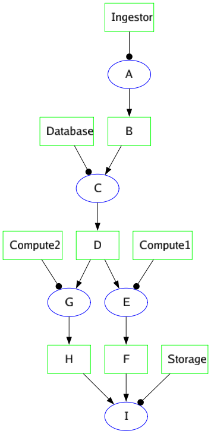
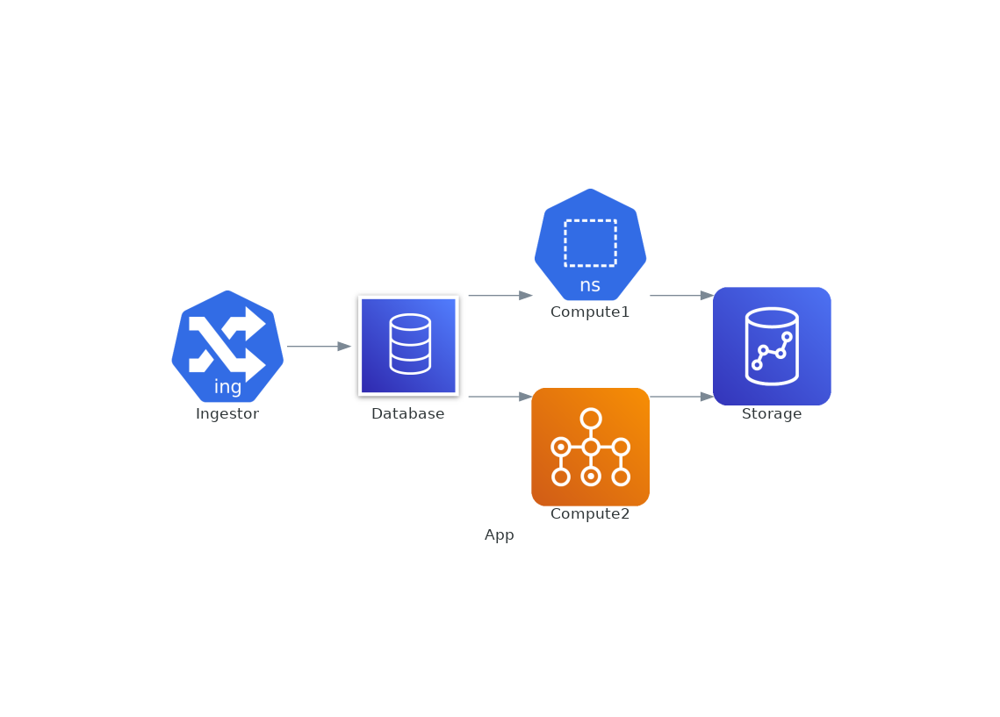
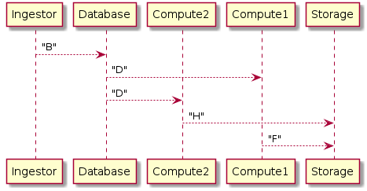

# PlosML - The PloshML System Modelling Language 

This repository contains the PloshML compiler. The compiler transforms an input structure, being the full system representation, to a number of views of the system. The modelling technique is loosly based on Object Process Methodology.

The language and compiler are based on a few basic statements : 

- The language should be fast and efficient to write in order for efficient work. 
- The language input should represent the full structural, logical and functional views of the system. Various views are derived from this one structure.
- The compiler should validate that the model is coherent and consistent. 
- Language simplicity is favoured over exspressiveness.


## Usage 

An input can be compiled via the following command
```bash
./ploshml -infile ploshml_input.opa
```

## Productions

PloshML has the capability of generating the following productions/yields serving as different views of the system. 

### Object Process Diagram


These diagrams can be generated in png, jpeg, svg and dot formats. 

### Software Artifact Diagrams


These diagrams are produced in dot format. Images are generated using graphviz/dot. An example for generating a png image would be

```bash
dot -Tpng filename.dot > image_filename.png
```

### Sequence Diagrams


These diagrams are produced in plantuml format. Images are generated using plantuml. An example for generating a png image would be

```bash
plantuml filename.puml
```

## Language

The example productions above are created by the following PloshML code. 

```
A -> B >- C -> D >- E -> F
D >- G -> H 
F, H >- I
lambda.Ingestor handles A 
dynamodb.Database handles C 
beanstalk.Compute1 handles E 
batch.Compute2 handles G 
redshift.Storage handles I
```

### Input format

Input to PloshML is presented as text files (typically with .opa extension) with UTF-8 encoding.

### Keywords

The following keywords are available witinin PloshML

- "->" : Produces, A -> B reads A produces B
- "<-" : Is produced by, A <- B reads A is produced by B
- ">-" : Is consumed by, A >- B reads A is consumed by B
- "-<" : Consumes, A -< B reads A consumes B
- "triggers" : Trigger relation, A triggers B reads as stated.
- "requires" : Requirement link, A requires B reads as stated
- "handles" : Agent link, A handles B reads as stated

In addition, the following language constructs are available

- "class" : Class definition, e.g., class Name
- "subroutine" : Same as class definition, e.g. subroutine Name
- "zoomin" : Class definition and immediate instanciation, e.g., zooming Name
- "call/as": Class instanciation, e.g. call ClassName as InstanceName

#### Reserved words

The following words are reserved for future use:

- "exhibits"
- "aggregates"
- "implements"
- "owns"
- "generalizes"

These reserved words are not allowed field names in an input. 

### Directives

The following directives are defined within PloshML

- "include" : Simple, C-like, include directive. 

### Magic Names

